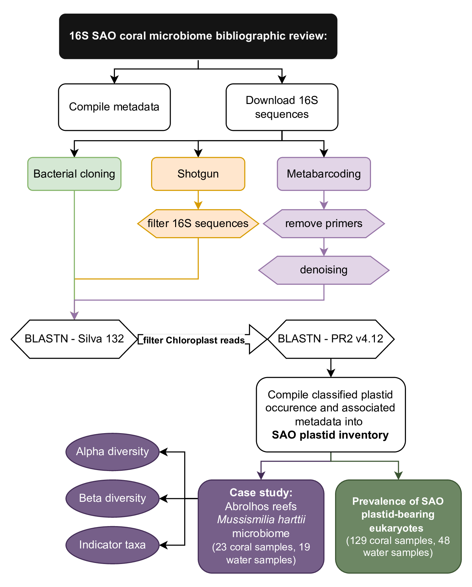

# Coral-Plastidiome

Repository containing the scripts and results from the compilation and re-evaluation of published resultd of culture-independent coral microbiome studies.

Results from this study are currently under review at PeerJ:
Pires CP, Villela LB, Moura RL, Salomon PS, Silva-Lima AW. Hidden microalgae diversity in reef systems: exploring plastid communities in Southwestern Atlantic Ocean coral microbiomes

Taxonomic assignment of microalgae plastid 16S gene sequences fortuitously observed in coral-microbiome studies is based on consensus-blastn searches against the phytoRef/PR2 database, version 4.12 (Decelle et al 2015).

Decelle J, Romac S, Stern RF, Bendif EM, Zingone A, Audic S, Guiry MD, Guillou L, Tessier D, Le Gall F, Gourvil P. Phyto REF: a reference database of the plastidial 16S rRNA gene of photosynthetic eukaryotes with curated taxonomy. Molecular ecology resources. 2015 Nov;15(6):1435-45.
