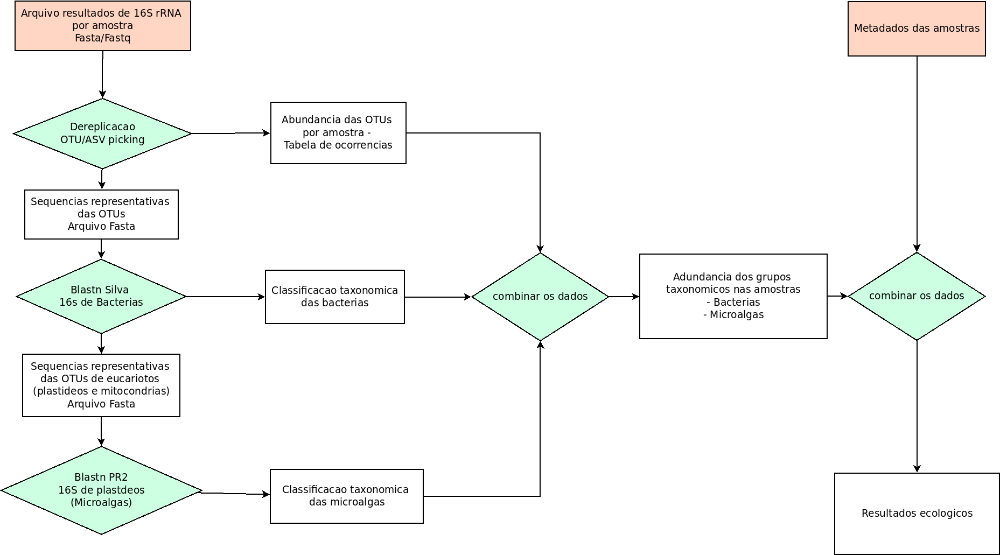

# Coral-Plastidiome

Compilation and re-evaluation of results of microbiomes associated with Brazilian corals. 

This study focus on the taxonomic and ecological evaluation of microalgae plastid 16S gene sequences fortuitously observed in coral-microbiome studies. Platid sequences taxanomic assignment is based on consensus-blastn searches against the phytoRef/PR2 plastidial database.

